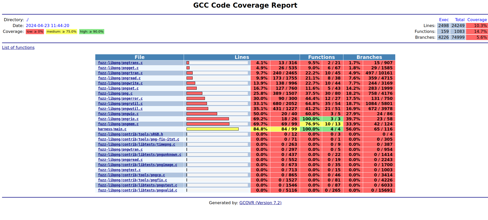

# libpng-fuzzer
My attempt at fuzzing libpng. 

## Usage
To build the fuzzer, just run:
```
make build
```

This will build both probing and fuzzing binaries. The probing binary is for manual analysis (to run the harness on a target then analyze the code coverage), while the fuzzing binary is for automated fuzzing using Honggfuzz.


### Fuzzing
To run the fuzzer, just run:
```
make run-fuzz
```

To minimize the corpus, run:
```
make run-fuzz-minimize
```

To view detailed fuzzing coverage (using `gcovr`) run:
```
make report-fuzz
```

### Probing
To run the probing binary (and observe the output), just run:
```
make run-probe HARNESS_PARAMS="./test_input.png ./test_output.png"
```

To view detailed probing coverage (using `gcovr`) run:
```
make report-probe
```

Those two steps can be combined into one:
```
make report-probe-run HARNESS_PARAMS="./test_input.png ./test_output.png"
```

### The Reports
For those who don't know, the generated by `gcovr` are amazing!



In case you need to clear the coverage data, just run:
```
make cleancov

# If you want to be more selective:
# make cleancov-probe # Clean the probing coverage data
# make cleancov-fuzz # Clean the fuzzing coverage data
```